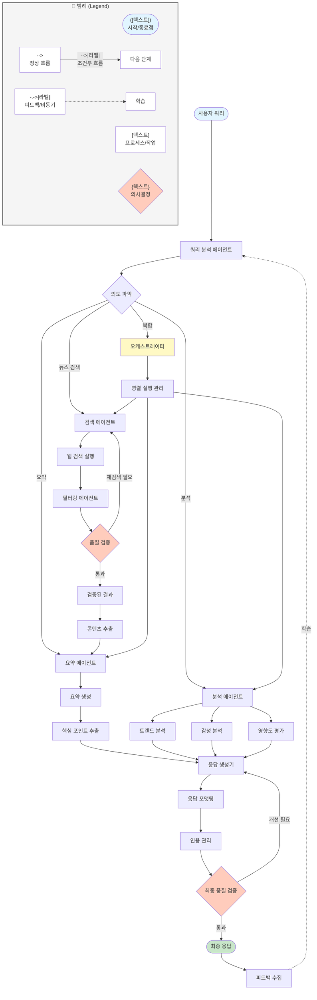

```mermaid
graph TD
    subgraph Legend["📖 범례 (Legend)"]
        direction LR
        L1(["([텍스트])<br/>시작/종료점"])
        L2["[텍스트]<br/>프로세스/작업"]
        L3{"{텍스트}<br/>의사결정"}
        L4["--><br/>정상 흐름"] -->|"-->|라벨|<br/>조건부 흐름"| L5[다음 단계]
        L6["-.->|라벨|<br/>피드백/비동기"] -.-> L7[학습]
    end

    Start([사용자 쿼리]) --> QueryAnalysis[쿼리 분석 에이전트]

    QueryAnalysis --> Intent{의도 파악}
    Intent -->|뉴스 검색| SearchAgent[검색 에이전트]
    Intent -->|요약| SummaryAgent[요약 에이전트]
    Intent -->|분석| AnalysisAgent[분석 에이전트]
    Intent -->|복합| Orchestrator[오케스트레이터]

    SearchAgent --> WebSearch[웹 검색 실행]
    WebSearch --> FilterAgent[필터링 에이전트]
    FilterAgent --> QualityCheck{품질 검증}
    QualityCheck -->|통과| ValidResults[검증된 결과]
    QualityCheck -->|재검색 필요| SearchAgent

    ValidResults --> ContentExtractor[콘텐츠 추출]
    ContentExtractor --> SummaryAgent

    SummaryAgent --> SummaryGeneration[요약 생성]
    SummaryGeneration --> KeyPoints[핵심 포인트 추출]

    AnalysisAgent --> TrendAnalysis[트렌드 분석]
    AnalysisAgent --> SentimentAnalysis[감성 분석]
    AnalysisAgent --> ImpactAssessment[영향도 평가]

    Orchestrator --> ParallelExec[병렬 실행 관리]
    ParallelExec --> SearchAgent
    ParallelExec --> SummaryAgent
    ParallelExec --> AnalysisAgent

    KeyPoints --> ResponseGenerator[응답 생성기]
    TrendAnalysis --> ResponseGenerator
    SentimentAnalysis --> ResponseGenerator
    ImpactAssessment --> ResponseGenerator

    ResponseGenerator --> FormatResponse[응답 포맷팅]
    FormatResponse --> CitationManager[인용 관리]
    CitationManager --> QualityAssurance{최종 품질 검증}

    QualityAssurance -->|통과| FinalResponse([최종 응답])
    QualityAssurance -->|개선 필요| ResponseGenerator

    FinalResponse --> FeedbackLoop[피드백 수집]
    FeedbackLoop -.->|학습| QueryAnalysis

    style Legend fill:#f5f5f5,stroke:#666,stroke-width:2px
    style Start fill:#e1f5ff
    style FinalResponse fill:#c8e6c9
    style Orchestrator fill:#fff9c4
    style QualityCheck fill:#ffccbc
    style QualityAssurance fill:#ffccbc
    style L1 fill:#e1f5ff
    style L2 fill:#fff
    style L3 fill:#ffccbc
    style L4 fill:#fff
    style L5 fill:#fff
    style L6 fill:#fff
    style L7 fill:#fff
```
